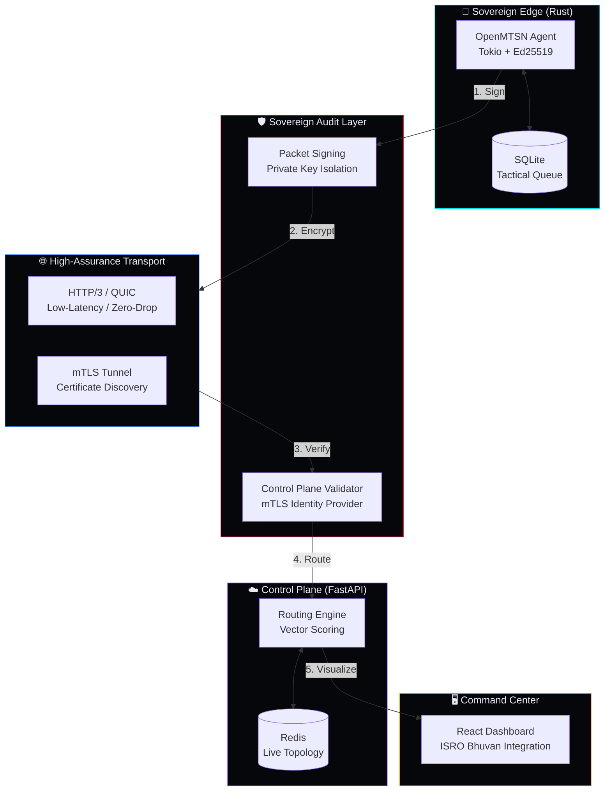
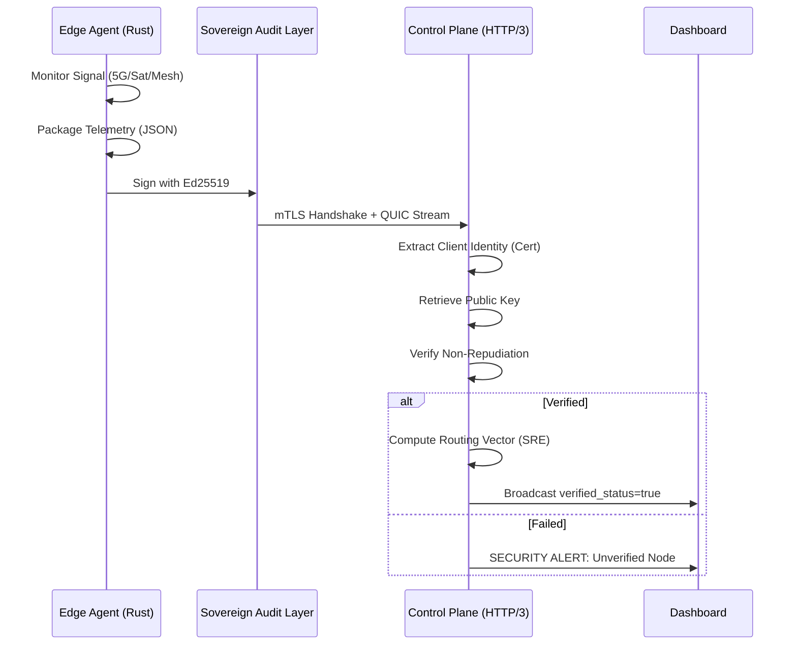

<div align="center">

# ◉ OpenMTSN: Sovereign High-Assurance Swarm Infrastructure

### Open Multi-Terrain Shared Network

**A production-grade, sovereign disaster response platform engineered for high-assurance situational awareness. Optimized for HTTP/3 (QUIC), cryptographic non-repudiation, and resilient edge compute.**

[](https://github.com/openmtsn/openmtsn/actions)
[](LICENSE)
[](docs/SOVEREIGN_AUDIT.md)
[](api/)

---

*"Where infrastructure fails, sovereignty endures. OpenMTSN provides a cryptographically verified, mathematically fault-tolerant backbone for mission-critical disaster recovery."*

</div>

---

## 🏛️ High-Assurance Architecture

OpenMTSN 2.0 has been hardened for high-stakes environments, transitioning from a generic telemetry app to a **Sovereign Audit** platform.



---

## 🔄 Telemetry Chain of Custody (Workflow)

The system ensures absolute integrity of situational awareness data through a multi-stage verification pipeline.



---

## 🚀 Key Strategic Features

### 1. Sovereign Audit (Ed25519)
Every telemetry packet originates with a cryptographic signature. The Control Plane verifies these signatures against a known identity provider (mTLS), ensuring that tactical data cannot be spoofed or altered in transit.

### 2. ISRO Bhuvan & Official Mapping
Synchronized with official **Indian Government (ISRO Bhuvan)** and Google India mapping data. The command center enforces official sovereign boundaries, including high-visibility overlays for restricted/monitored zones.

### 3. Tactical Edge Resilience
The Rust edge agent is built with zero OS dependencies (bundled libraries) and features an **autonomous SQLite persistence layer**. In "Blackout Mode," telemetry is queued locally and flushed with cryptographic integrity once a QUIC link is re-established.

### 4. Interactive Temporal Awareness
Mission-critical time synchronization across **UTC, IST, and Local** temporal modes, ensuring regional responders and global coordinators operate on a unified timeline.

---

## 🛠️ Quick Start (Vanguard Edition)

### 1. Local Hardened Simulation
Launch the high-assurance stack including the mTLS-ready Control Plane and signed agents:

```bash
git clone https://github.com/GauravSahu2/OpenMTSN.git
cd OpenMTSN
docker compose up -d --build
```

### 2. Identity Verification
The Control Plane is now accessible via **HTTPS** on port 8000.
- **RESTful Bridge**: [https://localhost:8000/docs](https://localhost:8000/docs)
- **Command Center**: [http://localhost:5173](http://localhost:5173)

---

## 📚 Technical Documentation

- [**Sovereign Audit Specification**](docs/SOVEREIGN_AUDIT.md): Cryptographic chain-of-custody details.
- [**Operations Runbook**](docs/OPERATIONS.md): Multi-cloud deployment and certificate rotation.
- [**Routing Algorithms**](api/app/routing_engine.py): Weighted vector failover logic.

---

<div align="center">

**OpenMTSN: Resiliency is a Sovereign Right.**
[Report Bug](https://github.com/GauravSahu2/OpenMTSN/issues) · [Request Feature](https://github.com/GauravSahu2/OpenMTSN/issues)

</div>
