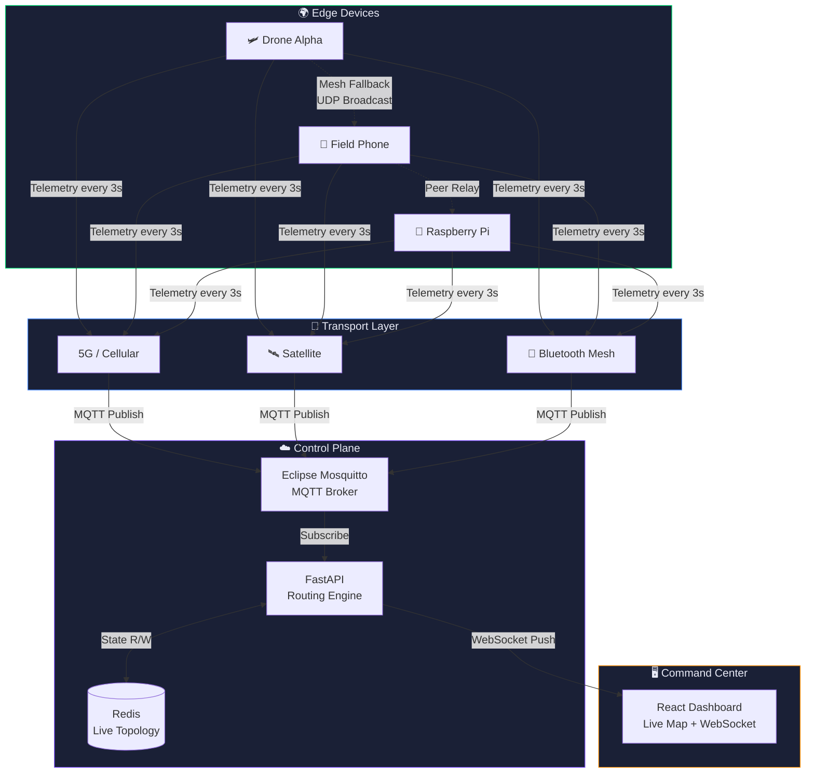

<div align="center">

# ◉ OpenMTSN

### Open Multi-Terrain Shared Network

**Zero-cost, open-source disaster response network controller that dynamically routes life-saving telemetry across 5G, Satellite, and Mesh networks with zero-drop handoffs.**

[](https://github.com/openmtsn/openmtsn/actions)
[](LICENSE)
[](https://github.com/openmtsn/openmtsn/pkgs/container/openmtsn)
[](infra/)

---

*When networks fail, people shouldn't. OpenMTSN ensures critical telemetry from drones, field devices, and first-responder phones always finds a path — even when infrastructure collapses around it.*

</div>

---

## The Problem

During natural disasters, the communication infrastructure that emergency responders depend on is often the first to fail. Cell towers collapse, fiber lines sever, and satellite links become congested with sudden demand spikes. **Every dropped packet could mean a lost life.**

## Our Solution

OpenMTSN provides a **mathematically fault-tolerant** control plane that:

- **Ingests real-time telemetry** from heterogeneous edge devices (drones, Raspberry Pis, phones)
- **Evaluates link health** using a weighted composite scoring algorithm (signal strength, packet loss, latency)
- **Triggers seamless failover** from degraded uplinks to alternatives — without dropping a single packet
- **Degrades gracefully** to local mesh networking when all cloud connectivity is lost

---

## System Architecture



---

## Core Routing Algorithm

The routing engine evaluates each telemetry packet using a **weighted decision matrix**:

| Factor | Weight | Threshold |
|--------|--------|-----------|
| Packet Loss | **40%** | > 15% → Failover |
| Signal Strength | **30%** | < 30 → Failover |
| Latency | **30%** | > 200ms → Warning |

**Priority Cascade:** `5G → Satellite → Mesh`

When a failover is triggered, the engine selects the next-best uplink with **geographic diversity** — if terrestrial links fail, it prefers satellite before falling back to local mesh relay.

---

## Quick Start — 1-Click Local Simulation

Spin up the entire MTSN sandbox with a single command:

```bash
git clone https://github.com/openmtsn/openmtsn.git
cd openmtsn
docker compose up -d
```

This launches:

| Service | Port | Description |
|---------|------|-------------|
| 🖥️ Dashboard | [localhost:5173](http://localhost:5173) | Real-time topology map |
| 🔌 API Docs | [localhost:8000/docs](http://localhost:8000/docs) | Interactive Swagger UI |
| 📨 MQTT Broker | `localhost:1883` | Eclipse Mosquitto |
| 💾 Redis | `localhost:6379` | Topology state store |
| 🛩️ node-alpha | — | Simulated drone (New Delhi) |
| 📱 node-beta | — | Simulated phone (Los Angeles) |
| 🔧 node-gamma | — | Simulated Pi (Sydney) |

### Run Chaos Test

Validate the failover logic by injecting 80% packet loss into `node-alpha`:

```bash
chmod +x simulator/chaos.sh
./simulator/chaos.sh full
```

---

## Tech Stack

| Layer | Technology | Purpose |
|-------|-----------|---------|
| **Control Plane** | Python 3.12 · FastAPI · Pydantic v2 | Async telemetry API + routing engine |
| **State Store** | Redis 7 | Live topology with TTL-based stale detection |
| **Edge Agent** | Rust · Tokio · rumqttc | Memory-safe daemon with MQTT + mesh fallback |
| **Message Broker** | Eclipse Mosquitto | Lightweight MQTT for IoT telemetry |
| **Dashboard** | React 18 · TypeScript · Leaflet | Real-time map with WebSocket updates |
| **Containerisation** | Docker · Docker Compose | Multi-stage builds, production-ready |
| **CI/CD** | GitHub Actions | Lint, test, mutation test, multi-arch Docker push |
| **IaC** | Terraform | AWS free tier + Azure free tier modules |

---

## Multi-Cloud Deployment

### AWS (Free Tier — t2.micro)

```bash
cd infra/aws
terraform init
terraform plan -var="key_pair_name=your-key"
terraform apply -var="key_pair_name=your-key"
```

### Azure (Free Tier — App Service F1)

```bash
cd infra/azure
terraform init
terraform plan
terraform apply
```

Both modules output the dashboard URL, API URL, and connection details.

> **Custom Domain + SSL:** See [docs/cloudflare-setup.md](docs/cloudflare-setup.md) for configuring a domain with automated SSL and DDoS protection via Cloudflare.

---

## Project Structure

```
MTSN/
├── api/                    # FastAPI Control Plane
│   ├── app/
│   │   ├── main.py         # FastAPI app + WebSocket endpoint
│   │   ├── models.py       # Pydantic v2 models
│   │   ├── routing_engine.py   # Core failover algorithm
│   │   ├── redis_client.py     # Async Redis topology store
│   │   └── config.py       # Environment-driven settings
│   ├── tests/              # pytest + mutation tests
│   ├── Dockerfile          # Multi-stage Python build
│   └── pyproject.toml
│
├── agent/                  # Rust Edge Telemetry Agent
│   ├── src/main.rs         # MQTT publisher + mesh fallback
│   ├── Cargo.toml
│   └── Dockerfile          # Multi-stage Rust build
│
├── dashboard/              # React Command Center
│   ├── src/
│   │   ├── App.tsx         # Main layout
│   │   ├── NetworkMap.tsx  # Leaflet live map
│   │   ├── Sidebar.tsx     # Node list + stats
│   │   └── index.css       # Premium dark theme
│   ├── Dockerfile          # Node build → Nginx serve
│   └── package.json
│
├── infra/                  # Terraform IaC
│   ├── aws/main.tf         # EC2 t2.micro free tier
│   └── azure/main.tf       # App Service F1 + IoT Hub
│
├── simulator/              # Chaos Engineering
│   ├── chaos.sh            # tc-based network degradation
│   └── mosquitto.conf      # MQTT broker config
│
├── .github/workflows/      # CI/CD Pipeline
│   └── main.yml
│
├── docker-compose.yml      # Full simulation sandbox
└── README.md
```

---

## Testing Strategy

| Level | Tool | Target |
|-------|------|--------|
| Unit Tests | pytest | Routing engine, Redis client, API endpoints |
| Integration Tests | pytest + httpx | Full API flow with fakeredis |
| Mutation Tests | mutmut | Mathematical fault-tolerance of routing logic |
| Chaos Tests | tc / netem | Network degradation → failover validation |
| Agent Tests | cargo test | Telemetry serialisation, network probing |

```bash
# Run API tests
cd api && pip install -e ".[dev]" && pytest -v

# Run mutation tests
cd api && mutmut run --paths-to-mutate=app/routing_engine.py

# Run Rust agent tests
cd agent && cargo test
```

---

## Contributing

We welcome contributions from engineers, disaster response professionals, and anyone passionate about resilient communication networks.

1. Fork the repository
2. Create a feature branch: `git checkout -b feat/your-feature`
3. Install pre-commit hooks: `pip install pre-commit && pre-commit install`
4. Make your changes and ensure tests pass
5. Submit a Pull Request

---

## Mission

> *"When the ground shakes, when the waters rise, when the towers fall — the network must not."*

OpenMTSN is built for NGOs, first responders, and disaster relief organisations who need **zero-cost, zero-drop** communication infrastructure. Every line of code in this repository serves one purpose: **keeping people connected when it matters most.**

---

<div align="center">

**MIT License** · Built with ❤️ for disaster response

[Report Bug](https://github.com/openmtsn/openmtsn/issues) · [Request Feature](https://github.com/openmtsn/openmtsn/issues) · [Discussions](https://github.com/openmtsn/openmtsn/discussions)

</div>
